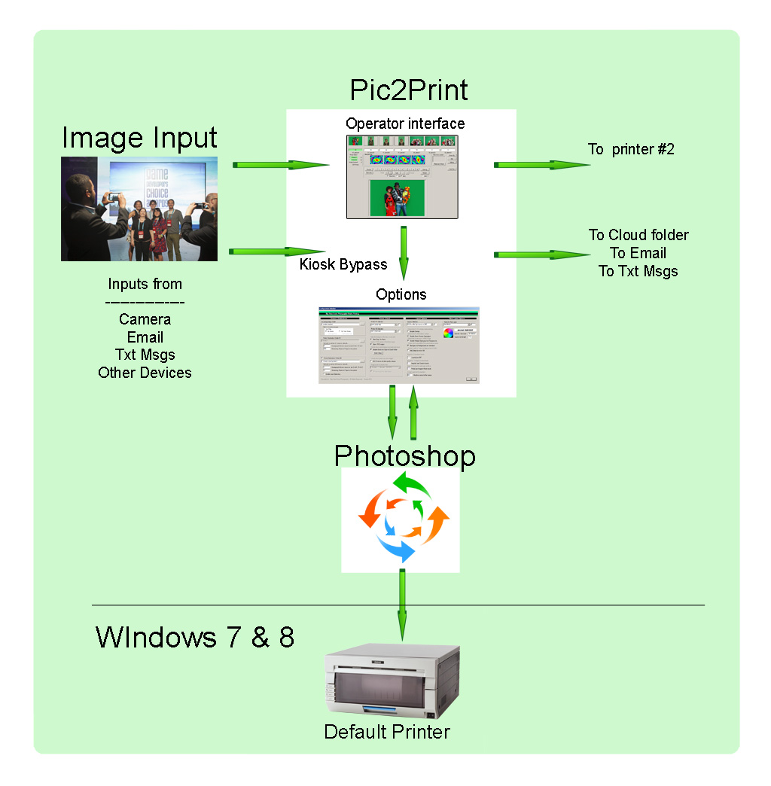

Photobooth Manager    
=========================================== 

BETA release 13.02 (A work in progress) 

Photobooth Manager is a photobooth software solution written for the IBM PC, using Adobe Photoshop Javascript, actions and Microsoft Visual Studio Visual Basic .NET 4.5, for XP, Win7 and Win 8.  This program system was written for Photoshop CS2 but runs on all subsequent versions. New to Version 13, is the integration of DigiCamControl for a automated camera capture. Now the photobooth can run from capture to delivery, no longer needing a photographer.
Here's an illustration to visualize it's operation -

Core to this repository, is "Pic2Print.exe", a VB.NET program that provides a user interface to an incoming stream of images.  For output, Animated gifs are supported and images and can be emailed, sent as MMS messages, and/or copied to another folder for dropbox or slideshows.  All this functionality works as of today with further enhancements forth coming (Everytime I use it on a job..).  The actual source code to Pic2Print will be located in its own repository, not in this package. 
 
Looking closer, Pic2Print operates on a set of folders for the entire workflow. See the list of folder below for more information. The main operations are Managed mode (ie, Operator intervention) and Kiosk mode (ie, Automatic mode).

In Managed Mode, the technician has a control panel and is given a "Refresh" button that turns green when new images arrive. Clicking "Refresh", the images are presented so the technician can select (i.e., click on) an image, an optional background (for greenscreen), then click a number between 1-10, for 1 to 10 prints.  If multiple images are needed (for photostrips or .GIFs), the technican clicks the first image, then the "L" button to load; repeating until the GIF/Number buttons are enabled. Once the buttons are enabled, the technician selects the last image, then clicks "GIF" or a numbered print button.

In Kiosk mode, the incoming images are processed according to selections made in the configuration panel.  That means the technician can specify foreground overlay, greenscreen, layout selection, # of prints per image, etc, and the kiosk mode will abide by these settings.  For example, selecting a three image photo strip layout with greenscreen and overlay, will be processed in Kiosk mode once three images land in the folder.

Additionally, six sets of predefined print layouts are supported in this base release, with further add-on packs added via other Github repositories.  The default set of layouts supports single image layouts, photostrips, and animated gifs, but the first add-on pack shows spectacular four layer animations.

To install this package -

Make sure you have Microsoft .NET framework 4.5 installed on your machine.  See the link below to download it.

Next, pull the PhotoboothMGR repository from github.  Once you pull it, copy/move the contents to a new folder. This folder must be named "OnSite" and must be located in the root of Drive C.  Sorry, but its hardcoded for now.  Here is a list of the required folders -

c:\OnSite                        - Parent folder and Kiosk folder. Any jpg landing here gets processed. 
c:\OnSite\actions                - holds Photoshop's action sets and javascript. 
c:\OnSite\backgrounds            - holds the print layouts in subfolders, spec'd by the .CSV files. 
c:\OnSite\cameras\dcc            - holds a complete unpacked release of DigiCamControl. 
c:\OnSite\capture                - incoming .jpgs  land here, for Managed Mode. 
c:\OnSite\cloud                  - suggested output folder for the cloud/slideshow.  Not really necessary. 
c:\OnSite\orig                   - after images are processed, the original files are moved here. 
c:\OnSite\printed                - the processed files are written here - .JPG, .GIF, .PSD with layers. 
c:\OnSite\software               - windows runtime code and support files. 
c:\OnSite\software\Documentation - Documentation for the product (A work in progress..).  

For first time installation, this next step is crucial.  This is a Windows issue, not an Adobe or PhotoboothMgr issue.  Windows UAC (User Access Control) must be turned off temporarily to allow communication between the Droplet and Photoshop.  Windows controls this backdoor and keeps it shut down due to virus/malware exploits.  So, in order to allow Droplets to communicate to Photoshop, follow these steps.

1) Turn off UAC
2) Reboot
3) upon rebooting, double click on "Launch.bat" in the software folder.  This will fireup photoshop and execute a droplet.
4) Re-enable UAC
5) Reboot again.

Windows registers the droplets association with photoshop and will now allow communcation between the separate programs.

Now, to continue with running the software -

Once you've re-enabled UAC and rebooted, doublc click "launch.bat" again which launches Pic2Print.  The batch file will also create any missing folders, and passes command line switches to Pic2Print, enabling some extra buttons, specifically, the Debug button. The debug button displays a separate form with a verbose listing of internal operations with helpful messages to verify email operations. Lastly, "launch.bat" fires off Photoshop with a sample JPG listing some printer setup instructions.

At this point, Photoshop should have fired-up via the "Launch.bat". if not, fire up photoshop manually. Remove any prior versions of "Onsite.Printing.atn" that might be loaded in the Action Palette.  Now, load the new "Onsite.Printing.atn" set found in "c:\OnSite\actions\" folder, by dragging & dropping the file into photoshop.  

If you are using Photoshop CS3 or later and encounter problems loading JPGs, you should rewrite the droplets found in the software folder. To rewrite the droplets, follow these instructions.

   In Photoshop, click "Window->Actions" to open the action palette.  
   Open the "Onsite.Printing" action set, click on the first action named "Automatic Mode - psload.exe droplet".
   Click "file->Automate->Create Droplet", navigate to "c:\OnSite\software" and select psload.exe. Click yes to overwrite
   this file.
   
   In the Action palette, click on "Close all - psclose.exe droplet".
   Click "file->Automate->Create Droplet", navigate to "c:\OnSite\software" and select psclose.exe. Click yes to overwrite
   this file.
   
   Again, in the Action palette, click on "Load only - justload.exe droplet".
   Click "file->Automate->Create Droplet", navigate to "c:\OnSite\software" and select justload.exe. Click yes to overwrite
   this file.

You should now be up and running. When Pic2Print does fire up, it opens the Operator Interface panel and the Options panel. In the Options panel, select your printer paper size, and the layout you wish to use.  Check the "File Output Only" box so you can process images without creating prints. I suggest selecting each layout, and generating test images to get to know the various layouts.  You can check/uncheck the foreground, greenscreen, multiple backgrounds, checkboxes, to see their effects on the images and operations. Also, email setup works fine.  MMS text messages go out as email to the various phone carriers.  See the "README.Email-Setup.txt" file for more information on setting up the email & cloud form.  Once you do some test runs, look in the "c:\OnSite\printed" folder to see the final outputs.  A copy of the original file is stored in the "C:\OnSite\orig" folder with what I call, a decorated file name.  

Printing Issues - 

For CS2, this system works by printing to the default printer, so make sure your photo printer is setup as the Windows default printer. Validate this setting via the Windows Control Panel applet. If you change default printers, you will have to restart photoshop. Once you've confirmed the default printer, load an image. This allows you to execute Photoshop's "File->Page Setup" for the proper print size and orientation.  The "launch.bat" file will pre-load 'pssetup.jpg' into photoshop showing some helps on the Sony and DNP printers.  (You can rewrite this file with your own instructions for your specific printer setup). 

For CS3 - CC, configure the 'File->Print' dialog for the attached printer, paper size, and check 'Scale to Media'  checkbox.  Once done, you're ready to print. Execute 'File->Print One Copy' to print 'pssetup.jpg'.  It might look ugly due to the uprezing, but if it prints, you're good to go. Uncheck the "File Output Only" checkbox in Pic2Print configuration panel and print away!  If prints do not come out, I recommend taking baby steps.  Load an image in photoshop and work out any problems printing it. Once that connection is established, use Pic2Print to print one image. 

Security Awareness -

If running a second printer, this printer will be on a second computer via a wired or wireless network.  This second computer will have to share the c:\OnSite folder with read/write access for the primary computer to deposit images for printing (Kiosk mode).   It is highly recommended that the c:\OnSite\software and c:\OnSite\actions folder be set to read-only access.  This is important if the computers run on a shared network with unknown devices.

All systems Go!  Please use GitHub Issues list on this repository to address problems and bugs. 

Doug Cody  
Bay Area Event Photography  
www.bayareaeventphotography.com  
www.portlandeventphotography.com   

Photoshop Version support -

07/21/16 13.02 Added support for the external software program, DigiCamControl to capture a sequence of images to build photostrips or any of the layouts supported.  A "Guest UI" windows was added to sit in the foreground with a big button to trigger the photo sequence.  Pic2Print looks at the selected layout to know how many frames to shoot.  Each image lands in c:\onsite so this only works in KIOSK mode, which makes most sense. So the program can now be triggered to shoot all frames, process all frames and send output to multiple targets.  Given its been a couple years since I've written release notes, its best to see the verion history to view all the changes and from here on out.

09/01/14 8.03 Update - Kiosk mode had a timing issue.  It was runnning too fast monitoring the c:\OnSite folder causing
problems with images from the network and Nikon Capture software.  A one second delay was added before accessing any incoming image, and the problem went away.  

In a two printer setup, the main machine was writing both config.txt files to the c:\OnSite folder.  This is useful but became confusing when unexpected changes happended on the remote machine.  This feature is disabled so both computers now must be configured separately. Better this way, no surprises.  You get what you set..

08/09/14 Update - Printing and GIF generation has now been tested on all versions of CS2 - CC!  Just make sure to rewrite the droplets after installation to make sure those match the installed version of Photoshop.

08/02/14 Update - Printing in CC and CS5 now works!. The disappointment is CS3 and CS4 might never work correctly.  In the rewrite of the CS3->CC print engine, two print options are presented now.  First is the 'File->Print' form, and secondly, the 'File->Print One Copy'.  CS3 and CS4 do not record all the printer settings in actions, and do not recognize the "Print One Copy" function in an action, so it looks like these versions are permanently disabled. CS5 and CC (and assuming CS6) DO record and save the state of both dialogs, thus work correctly in executing "Print One Copy" from under direction of the pre-recorded action.

Setting up the printer is a two step process.  "launch.bat" will start Photoshop loading the .JPG called "pssetup.jpg". This enables the first printer menu option in the "File" pull-down menu. This option is called "Print Setup" in CS2, and called  "Print" in CS3 - CC.  As the first step, the operator must execute the'File->Print' dialog, to select the printer, paper size, orientation, etc. The options in this dialog are dynamic and may need to be setup everytime photoshop is fired up.  Fortunately, Photoshop CC will save these settings between sessions.  The second step is executed via Pic2Print, using the Javacript and photoshop actions. These actions execute the 'File->Print One Copy' option for each print, using the settings in the first step. 

07/28/14 Update - CS3, CS4, CS5 and CC have been tested. GIFs work, but printing is problematic. Use CS2!!!  CS3 and upwards hardcode printer configurations in the actions and will cause you nightmares because the action will have to be re-recorded everytime you setup and operate on a job. Hopefully, there will be a workaround. I might just add some VB code to do the actual printer output to avoid PS altogether..
 
References - 

The mail program is a github project - https://github.com/muquit/mailsend.  Please send kudos and cash..

The camera trigger software - http://www.digicamcontrol.com.  Please donate to keep this project alive.

Microsoft .NET framework 4.5 download page - http://www.microsoft.com/en-us/download/details.aspx?id=30653 

Inspiration -

My daughter, Michelle Palmer, who needed this program to get started in the business.

